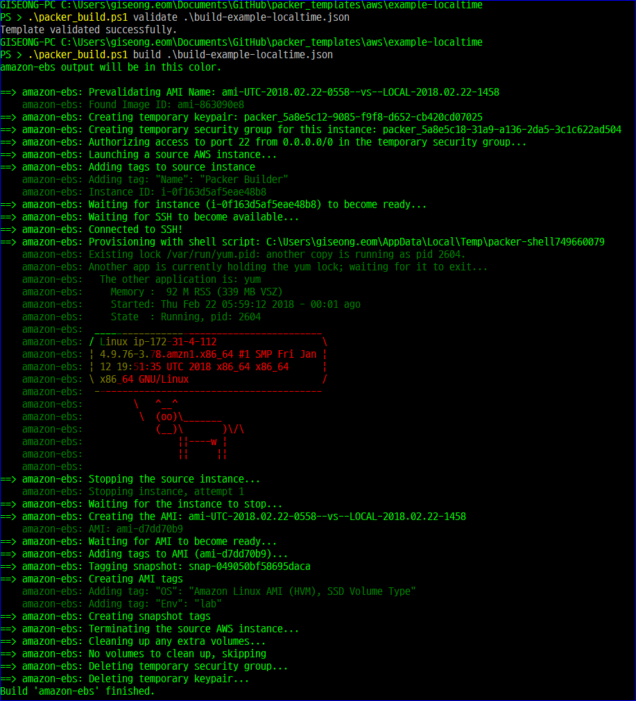

TIP: Using localtime insteand of UTC (isotime) 
============================


## isotime vs localtime
* packer_build.ps1
```powershell
#Requires -Version 5

# GET-DATE format YYYY.MM.DD-HHMM
$env:_MY_AWS_BUILD_DATE_LOCALTIME=""
$env:_MY_AWS_BUILD_DATE_LOCALTIME=(get-date -UFormat %Y.%m.%d-%H%M)
```

* build-example-localtime.json
```json
{
  "variables": {
    "build_date_locatime": "{{env `_MY_AWS_BUILD_DATE_LOCALTIME`}}",
  },
  "builders": [
    {
      "ami_name": "ami-UTC-{{isotime \"2006.01.02-1504\" | clean_ami_name}}--vs--LOCAL-{{user `build_date_locatime`}}", 


```


## Build

```powershell
# packer validate
PS > .\packer_build.ps1 validate .\build-example-localtime.json
Template validated successfully.

# packer build
PS > .\packer_build.ps1 build .\build-example-localtime.json
amazon-ebs output will be in this color.
.... blahblah
```

## Screenshot




